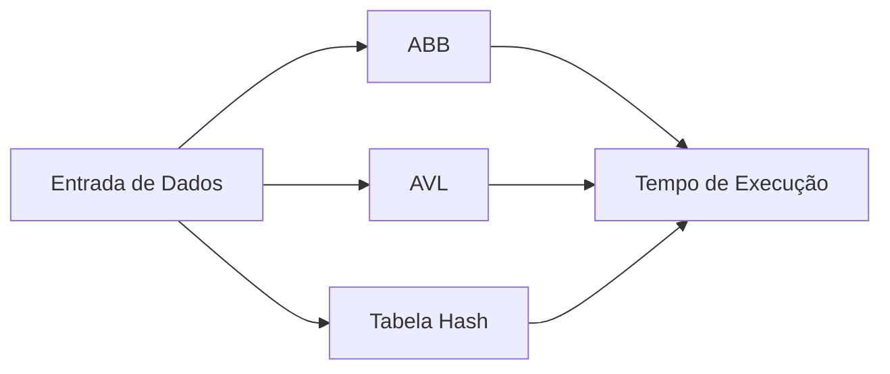

# benchmarking-datastructure
```c
/* =============================================
   Sistema de Benchmarking de Estruturas de Dados
   Disciplina: Algoritmos e Complexidade Computacional
   Universidade Federal do Ceará (UFC)
   Linguagem: C
   ============================================= */
```

<div align="center">

# 🧪📊 Benchmarking de Estruturas de Dados

```txt
[ ABB ]  vs  [ AVL ]  vs  [ HASH ]
```


</div>

---

## 📌 Descrição Geral

```txt
Projeto acadêmico focado em medir e comparar
 o desempenho de estruturas de dados clássicas
 através de tempo de execução.
```

Sistema de **Benchmarking** desenvolvido para a disciplina de **Algoritmos e Complexidade Computacional** da **Universidade Federal do Ceará (UFC)**.

O objetivo é realizar uma **análise comparativa prática** entre diferentes estruturas de dados avançadas, avaliando seu comportamento em diferentes cenários de entrada.

---

## 🎯 Objetivo do Benchmark

```c
// Objetivo principal
// Comparar o tempo de execução entre estruturas
// de dados sob diferentes distribuições de dados
```

* Analisar desempenho real além da notação assintótica
* Comparar custo computacional de inserção e busca
* Observar impacto do balanceamento e da função hash

---

## 🌳 Estruturas Implementadas

### 🌱 Árvore Binária de Busca (ABB)

```txt
      8
     / \
    3   10
   / \    \
  1   6    14
```

```c
// Propriedade da ABB
// esquerda < raiz < direita
```

Estrutura baseada em nós onde os valores menores ficam à esquerda e os maiores à direita da raiz.

---

### 🌲 Árvore AVL

```txt
      8
     / \
    4   10
   / \     \
  2   6     14
```

```c
// Propriedade AVL
// |altura(esq) - altura(dir)| <= 1
```

Árvore binária de busca **auto-balanceada**, garantindo altura controlada e melhor desempenho.

---

### 🔐 Tabela Hash

```txt
Índice | Valor
------+-------
  0   |  --
  1   |  42
  2   |  --
  3   |  17
```

```c
int hash(int chave, int tamanho) {
    return chave % tamanho;
}
```

Estrutura baseada em **função hash** que mapeia chaves diretamente para posições do vetor.

---

## ⏱️ Metodologia de Benchmarking

```c
clock_t inicio, fim;
inicio = clock();

// execução da estrutura

fim = clock();
double tempo = (double)(fim - inicio) / CLOCKS_PER_SEC;
```

* Implementação manual das estruturas em **C**
* Uso da biblioteca **time.h** para medição de tempo
* Execução sob diferentes conjuntos de dados

---

## 🛠️ Tecnologias Utilizadas

```txt
• Linguagem C
• Biblioteca time.h
• Estruturas de dados clássicas
• Análise de desempenho
```

---

## 📈 Visualização



---

## 🧠 Principais Aprendizados

```txt
• Ordem de inserção impacta fortemente ABB
• Balanceamento garante desempenho previsível
• Hash depende da função e do tratamento de colisões
```

---

```txt
Projeto desenvolvido exclusivamente
para fins acadêmicos – UFC
```


